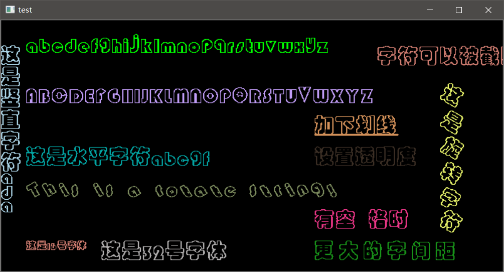
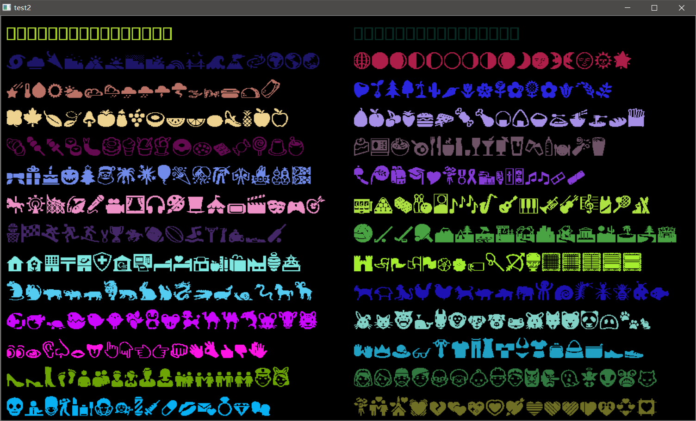

# freetype_opencv

----

更新：2020-11-14

* 修改了画字形时移动画笔的方法（英文字体有高度位置关系，看起来更合适，但也有一点问题）
* 修改多字节转 wchar 的方法，删除了原来跨平台的部分

> 修改了画字形的方法后，也引出了另一个问题，根据 freetype 官方的说明，使用修改后的画图方法会使得画的文字位置与你想要的位置有一定的偏差，因为我的代码里是使用字型的 origin 点作为 pos。因此，为了画出你想要的结果，可以在定位时稍微将 pos 的 y 增加一点点。或者在 putWChar 函数中的 gPos 加上一个 0 ~ font size 的值。

为了方便直接使用，我创建了两个分支

* Clion 项目分支
* Visual Studio 项目分支

你也可以新建项目，拷贝主分支的代码。

----

更新：2020-3-5

* 重构代码
* 添加下划线
* 测试了其他字符集（包括日语和 Segoe UI)

----

更新：2019-11-2

* 使用 OpenCV 4.1
* 使用 freetype 2.10.1
* 支持 竖向文字、旋转文字

----

## [使用说明](https://github.com/busyboxs/freetype_opencv/blob/master/usage.md)

## 运行效果

中文测试效果

Unicode 字符测试效果（需要使用对应的字体）

