# Visual Studio Opencv 环境配置 - 手动配置

## 本机环境

* Windows 10
* Visual Studio Community 2017 (version 15.9.17)
* OpenCV 4.1.2

## OpenCV环境配置

首先下载 OpenCV 最新版本，下载地址： [opencv-win](https://sourceforge.net/projects/opencvlibrary/files/opencv-win/)

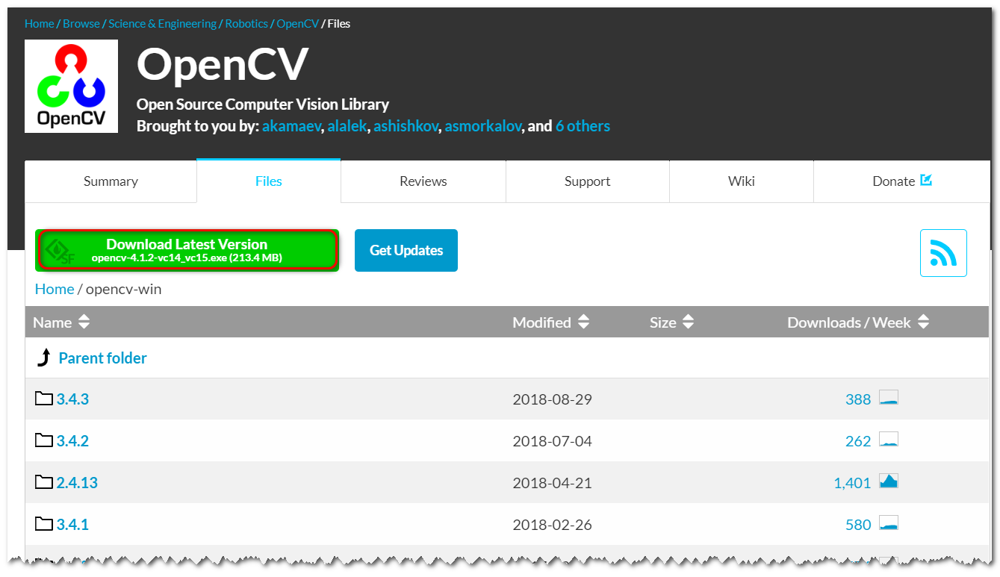

然后运行下载的文件，选择提取文件的路径，并提取文件。

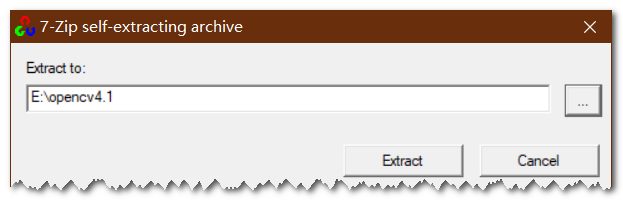

提取完成后添加 PATH 环境。首先新建一个环境变量

> 变量名： `OPENCV_DIR`
> 变量值： `E:\opencv4.1\opencv\build`

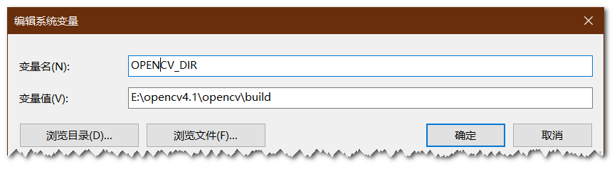

然后在 PATH 中新建变量。并添加以下路径

```
%OPENCV_DIR%\x64\vc15\bin
```

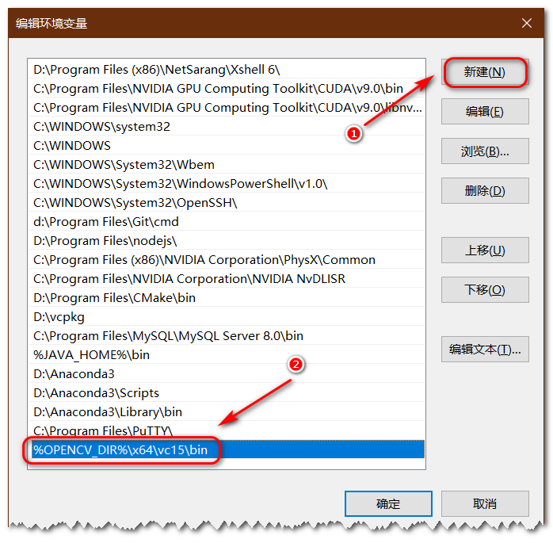

## Visual Studio 配置属性

首先打开 Visual Studio 并新建一个空应用。

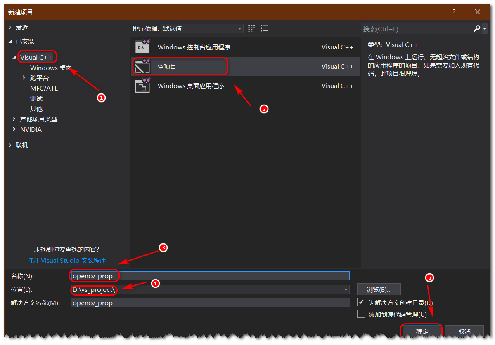

然后新建一个原文件 `main.cpp`。

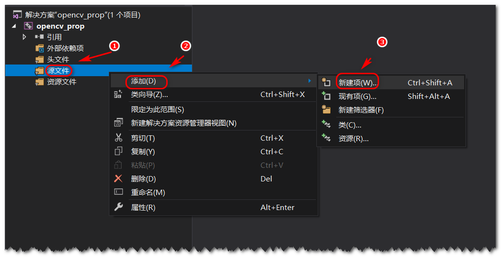

然后打开属性管理器，进行配置。这里只以 `Debug|x64` 为例，其他的配置相似。

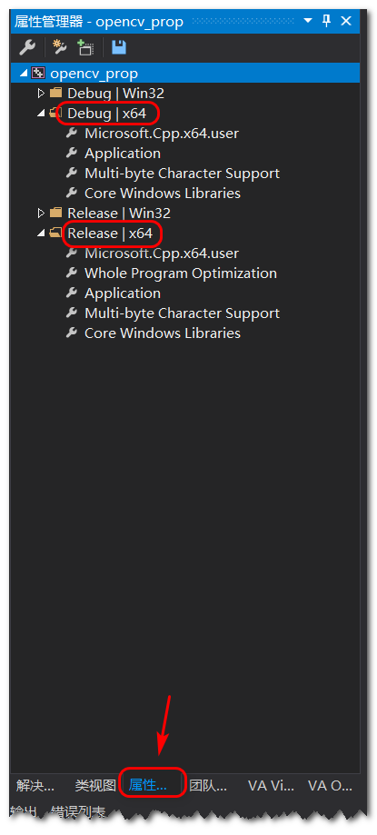

鼠标右键 `Debug|x64`，选择 “添加新项目属性表”。文件名为 `OpenCVDebug`。

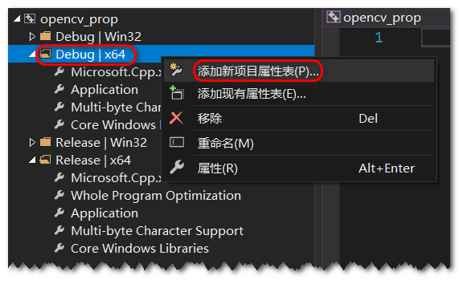


然后鼠标右键 `OpenCVDebug`，选择 “属性”。

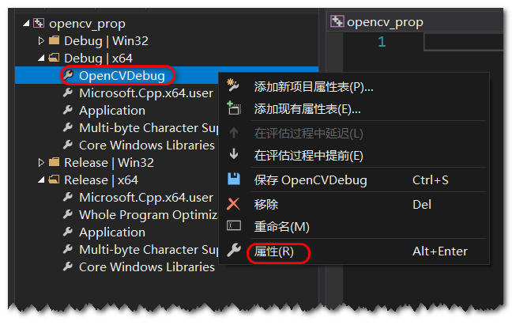

这里需要配置的地方有 3 个，分别是 “包含目录”、 “库目录” 和 链接器输入的 “附加依赖项”。

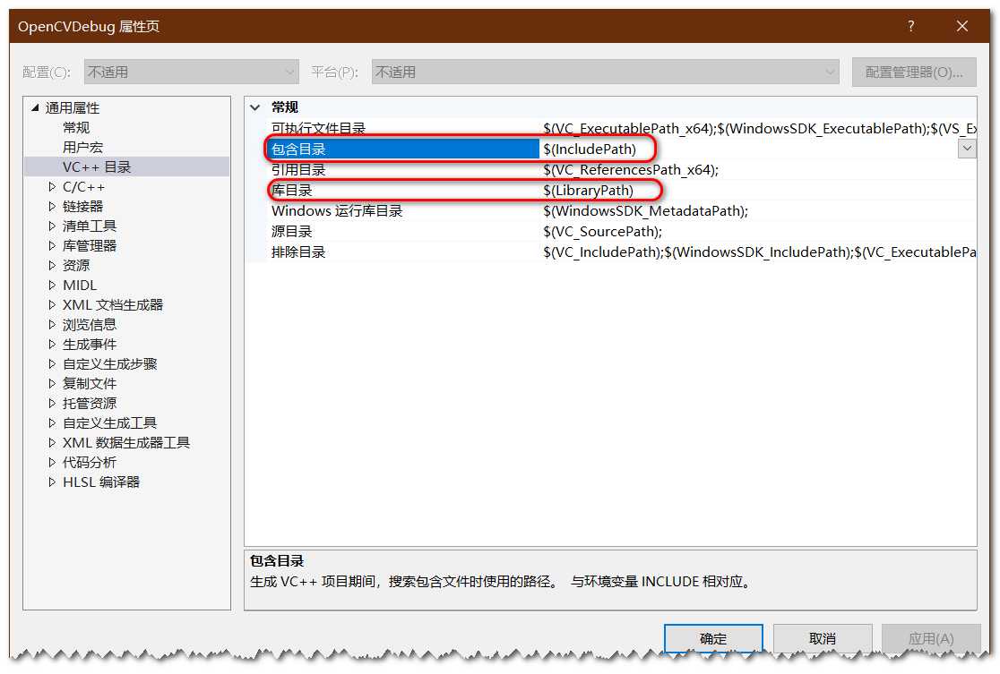

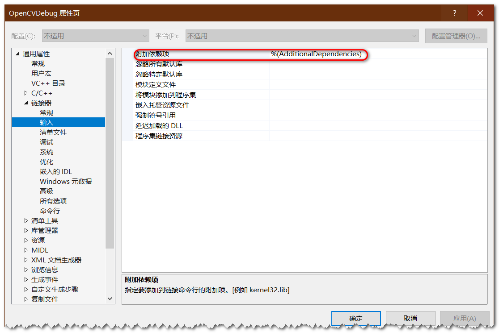

包含目录里需要添加两个字段

```
$(OPENCV_DIR)\include\opencv2
$(OPENCV_DIR)\include\
```

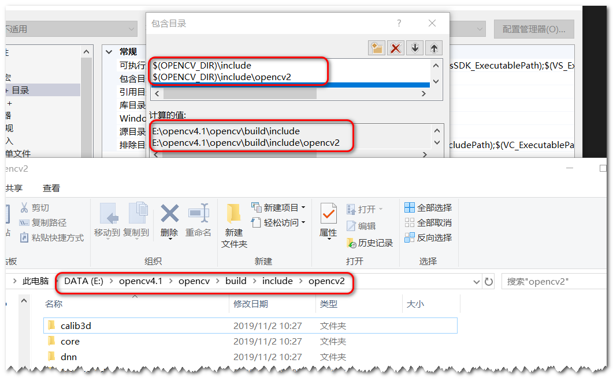

如上图所示，当我们添加了这两个字段后，会得到计算值，必须保证这个计算值得路径是正确的，能够访问到文件。

库目录里需要添加一个字段。由于下载的 OpenCV 只编译可 x64，因此这里只能配置 x64 的编译环境，如需要使用 win32 的编译环境，需要自己编译 OpenCV。

```
$(OPENCV_DIR)\x64\vc15\lib
```

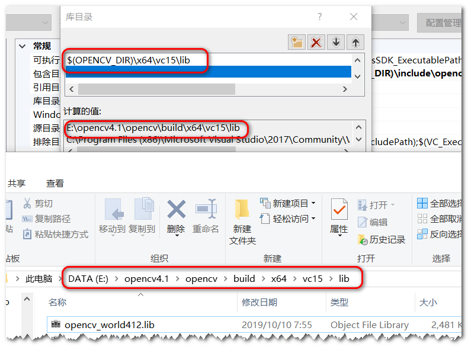

同样需要保证计算的值是正确的。

附加依赖项需要添加 lib 文件名。也就是库目录下的 lib 文件的名字。其中数字后面带 `d` 的是表示 Debug 模式编译的，不带 `d` 的表示 Release 模式编译的。

```
opencv_world412d.lib
```

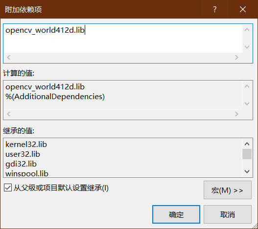

至此，Visual Studio OpenCV环境已经配置好了。

## OpenCV 测试

在 `main.cpp` 文件中输入以下代码。注意根据你的 OpenCV 的提取目录修改图像文件路径。

```
#include <opencv2/opencv.hpp>
#include <iostream>

int main() 
{
	cv::Mat img = cv::imread("E:\\opencv4.1\\opencv\\sources\\samples\\data\\lena.jpg");
	if (img.empty()) {
		std::cout << "Can not read image" << std::endl;
	}
	cv::imshow("image", img);
	cv::waitKey();
	return 0;
}
```

如果能够显示图像则表示环境配置成功。

