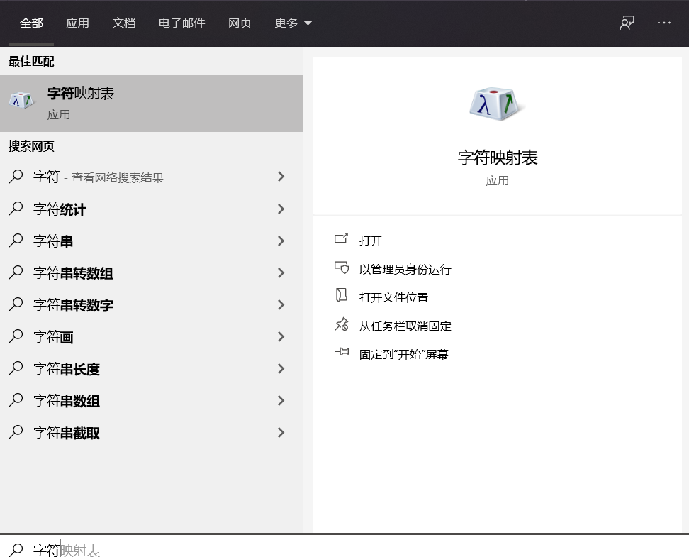
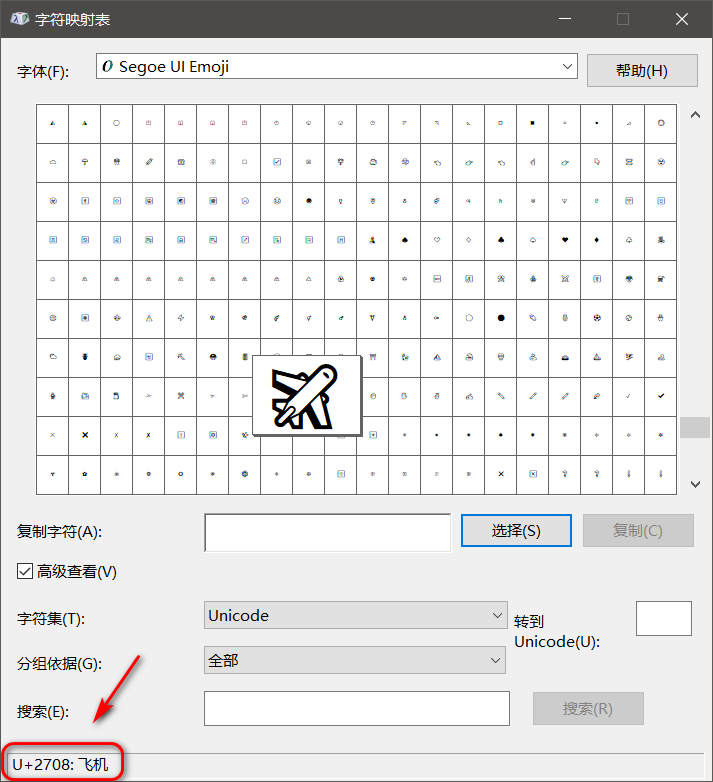

# 该项目使用说明文档

## 环境配置

### 1. Visual Studio 手动配置

* 手动配置： [OpenCV 在图像中显示中文](https://github.com/busyboxs/freetype_opencv/blob/master/opencv_puttext_zh.md)

### 2. Visual Studio Vcpkg 配置

* Vcpkg 配置：[Vcpkg 配置 freetype 和 OpenCV](https://github.com/busyboxs/freetype_opencv/blob/master/opencv_visual_studio.md)

### 3. Clion 配置

* 配置文件参考：[CMakeLists](https://github.com/busyboxs/freetype_opencv/blob/master/opencv_puttext_zh/CMakelists.txt)

----

## 项目说明

分别使用对应的 IDE 创建项目，然后把代码添加或者拷贝进去即可

项目主要代码文件如下：

* `CvxText.cpp`
* `CvxText.h`

测试代码如下：

* `Chinese_test.cpp`
* `Japanese_test.cpp`
* `symbol_test.cpp`
* `main.cpp`

字体可以直接从 windows 系统（`c:\windows\fonts`）里复制过来，然后放到 font 文件夹下。

----

## 使用说明

代码中定义了一个字体类，字体属性包含以下

```cpp
int fontSize;           // 基于像素的字体大小
float spaceRatio;       // 空格字符与文字字符的占比（相对于字符）
float fontRatio;        // 字符与字符之间空间的占比（相对于字符）
float fontRotateAngle;  // 字符旋转的角度
float fontDiaphaneity;  // 字符透明度（与背景融合占比）
bool fontIsUnderline;   // 下划线标志
bool fontIsVertical;    // 竖直方向字符标志
```

这些属性都可以通过类的 `get*-` 和 `set*-` 设置和获取对应的属性。默认情况下（初始化）

```cpp
fontSize = 32;
spaceRatio = 0.5f;
fontRatio = 0.1f;
fontRotateAngle = 0;
fontDiaphaneity = 1;
fontIsUnderline = false;
fontIsVertical = false;
```

主要的画字符的函数为

* putText: 画文字字符
* putSymbols: 画多个符号字符
* putOneSymbol: 画单个符号字符

```cpp
void putText(cv::Mat& img, const std::string& text, cv::Point pos, cvx::CvxFont& fontFace, int fontSize, const cv::Scalar& color);
void putSymbols(cv::Mat& img, std::vector<uint32_t>& symbols, cv::Point pos, cvx::CvxFont& fontFace, int fontSize, const cv::Scalar& color);
void putOneSymbol(cv::Mat& img, uint32_t symbol, cv::Point pos, cvx::CvxFont& fontFace, int fontSize, const cv::Scalar &color);
```

其参数和 OpenCV 自带的 `putText` 相似，为了区分，我将其放到了 `cvx` 命名空间中，因此调用时需要加上命名空间，例如：

```cpp
 cvx::putText(img, msg, cv::Point(40, 20), font, fontSize, cv::Scalar(0, 255, 0));
```

当需要画下划线、旋转字符或者竖直字符时，需要在调用 `putText` 函数之前设置对应的属性，这些属性在 `putText` 执行完之后会自动重新初始化，因此每次都需要单独设置，因为这几个属性相对来说用的很少，所以基本上不怎么设置。例如画竖直旋转字符时

```cpp
void testVerticalRotate(cvx::CvxFont& font, cv::Mat& img) {
    //    cv::RNG rng(0xFFFFFFFF);
    int fontSize = 32;
    float angle = -30;
    font.setVertical(true);
    font.setRotateAngle(angle);
    cv::String msg5 = "这是旋转字符";
    cvx::putText(img, msg5, cv::Point(700, 100), font, fontSize, randomColor(rng));
}
```

----

## 字符集说明

对于中文文字直接输入文字即可，对于符号字符，需要查对应的 unicode 字符集得到对应的 unicode 编码。

* [SegoeUISymbol 字符集](http://www.kreativekorp.com/charset/font/SegoeUISymbol/) : 这个 windows 系统下有对应的字体，可以直接拷贝过来用，该项目的字体中也有提供
* [Unicode 12.1 Character Code Charts](http://www.unicode.org/charts/) : 这个里面包含各种各样的字符集

Windows 上自带字符映射表。直接在开始菜单搜索 “字符映射表” 就能找到。





该应用可以查到对应字体中符号的 unicode 编码，这个编码在画图的时候会用到。
